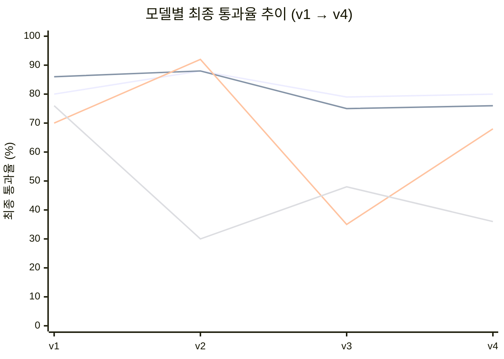

# Model 선택

## 결론: **qwen2.5:7b**

v1(인공 문서)→v4(실제 템플릿) 전 구간에서 유일하게 상위권을 유지한 모델.

qwen 계열 둘만 굴곡 없이 70%대 후반~80%대를 유지한다. exaone은 v2(92%)→v3(35%)로
급락했다가 v4(68%)로 반등 — 조건에 따라 순위가 뒤집히는 불안정성 자체가 감점 요인.
gemma는 v2 이후 계속 30%대에 머문다.

## 근거 — 버전별 최종 통과율

| 버전 | qwen2.5:7b | qwen2.5-coder:7b | exaone3.5:7.8b | gemma3:4b |
| --- | --- | --- | --- | --- |
| v1 (인공 문서, 6종 군) | **80%** (579/720) | 86% (309/360) | 70% (503/720) | 76% (547/720) |
| v2 (인공 문서, JSON) | 88% (140/160) | 88% (70/80) | 92% (147/160) | 30% (71/240) |
| v4 (**실제 템플릿**, 통일 채점) | **80%** (80/100) | 76% (76/100) | 68% (68/100) | 36% (36/100) |

**v4가 결정 근거로 가장 무겁다** — 인공 문서(370~590자)가 아니라 실제 제품 템플릿(4,351~5,356자)을 같은 채점기로 쟀다.

## qwen2.5-coder:7b — 사실상 동급, 대체 후보로 유효

- v4 S-E(수정) 둘 다 **50/50 만점**, 클래스 파손 0건 — 차이는 K-T(구조 변경)에서만 24%p
- v1에서 이미 재시도 의존도 낮은 편, 코드/마크업 특화 모델이라 HTML 생성 목적과도 부합

## 탈락: gemma3:4b

| 근거 | 수치 |
| --- | --- |
| v2 K(패치) 전멸 | 0/150 |
| v4 K-T(실제 템플릿) | 1/50 (2%) |
| v4 마크업 파손 | `unmatched_closing_tag_div`·`mismatched_nesting_section` — **gemma에서만 발생** |
| v1(232자)과의 격차 | 작은 문서에서만 "완벽 복사" — 크기 조건부였음이 v4로 확인됨 |

저사양 대안으로 문서에 남아있었으나, **실제 크기 문서에서는 채택 불가**.

## 보류: exaone3.5:7.8b

- v2 CHAIN(K 강세)에서는 92%로 1위였으나 **v4 실제 템플릿에서는 68%로 하락** — 조건이 실제 크기로 바뀌자 순위가 뒤집힘
- v3 실행에서 Ollama 클라이언트/서버 버전 불일치로 결과 신뢰도 이슈 있음(재실행 필요)
- S-E `class_lost` 15/50 — 두 기기에서 동일하게 재현되는 모델 고유 결함

## 확정 조건

| 항목 | 값 |
| --- | --- |
| 최종 후보 | `qwen2.5:7b` |
| 대체 후보 | `qwen2.5-coder:7b` (수정=E 경로만 쓸 경우 완전 동급) |
| 재현 기기 | 도하(metal)·주호(cpu), seed 5회 — **2기기뿐, v1(4기기)만큼 두텁지 않음** |
| 다음 확인 | 3번째 기기(cuda) 추가, exaone은 Ollama 버전 정리 후 재측정 |
