# 생성 + 수정 + JS 생성/수정 방식

모델은 `model.md` 참고 — **qwen2.5:7b** 기준 수치.

## 축별 결론

| 축 | 채택 | 근거 수치 |
| --- | --- | --- |
| 신규 생성 | **S 또는 J — 미확정** | v2 McNemar: S↔J 대부분 무의미(불일치 0쌍, 인공 문서 기준) — 실제 템플릿 크기에서는 아직 하나도 못 쟀음(§1 참고) |
| 기존 문서 수정 | **E** (HTML 블록 왕복 편집) | v4 실제 템플릿: **S-E 50/50(100%) vs K-T 30/50(60%)** — 인공 문서에서의 "K가 안전하다"는 결론이 실제 크기에서 뒤집힘 |
| JS 추가 | **JS-PLAN** (생성 시점에 포함) | v3: JS-PLAN 29/30 vs JS-PATCH(사후 추가) 22/30 |
| JS 값 수정 (날짜 등) | **보류** | v3 CHAIN2(순수 JSON 4단계) 1/15 vs CHAIN6(HTML+JSON 교차) 15/15 — 경로에 따라 갈림, 추가 검증 필요 |

## 1. 신규 생성 — S or J, 미확정

- S1~S9(v1) ↔ J1/J2/J8/J9(v2) 요청 문구 동일 조건 비교, McNemar 정확검정 결과 **qwen2.5:7b·qwen2.5-coder:7b는 완전 동률**(불일치 0쌍) — 이 결과만 보면 J가 안전 쪽에서 유리해 보임(`render_plan()`이 마크업을 조립하므로 태그가 깨질 수 없음)
- **그런데 이 비교는 인공 문서(370~590자) 기준이다.** §2에서 E↔K 비교가 실제 템플릿 크기로 바뀌자 결론이 뒤집혔던 것과 같은 구조 — 신규 생성도 실제 템플릿 크기(4,351~5,356자)에서는 **아직 하나도 못 쟀다**(`num_predict` 1536 초과로 v4에서 전부 미측정, §5)
- 즉 지금 있는 신규 생성 비교는 정확히 §2가 "믿으면 안 된다"고 보여준 그 조건(인공 문서) 위에서 나온 것 — **S와 J 중 하나를 지금 단계에서 확정하는 건 근거가 부족하다.** 캡을 올려 실제 크기로 재기 전까지는 둘 다 후보로 남긴다

## 2. 기존 문서 수정 — E

인공 문서 vs 실제 템플릿 비교가 결론을 뒤집은 핵심 지점. (v4는 이 축의 테스트
그룹을 "S-E"라 이름 붙였다 — S 규칙으로 쓰는 HTML 생성기를 블록 하나에 좁혀 쓰는
방식이라 그런 이름이지, 실제로 재는 건 methodology.md의 **E군(왕복 단위)**이다.)

```mermaid
%%{init: {"xyChart": {"plotColorPalette": "#4e79a7, #f28e2b, #e15759, #59a14f, #b07aa1, #edc948, #76b7b2, #ff9da7"}}}%%
xychart-beta
    title "v4 실제 템플릿 — 수정 경로별 최종 통과율 (%)"
    x-axis ["qwen2.5:7b", "qwen2.5-coder:7b", "exaone3.5:7.8b", "gemma3:4b"]
    y-axis "통과율 (%)" 0 --> 100
    bar "S-E (HTML 블록 수정)" [100, 100, 80, 70]
    bar "K-T (JSON 패치)" [60, 52, 56, 2]
```



네 모델 전부 S-E가 K-T보다 높고, gemma는 K-T에서 사실상 전멸(2%)한다.

| 조건 | E 계열 | K 계열 |
| --- | --- | --- |
| v2 인공 문서(370~590자) | — | 88~92% |
| **v4 실제 템플릿(1,000~1,500자)** | **100%** (50/50) | 60% (30/50) |

- K의 지배적 실패는 `no_ops`(30%, 219/725건) — **패치 오퍼레이션 자체를 못 냄**
- 구조 변경(항목 추가/삭제) 요청 시 K는 전 모델 0/5 (KT3) — 실사용에서 흔한 요청인데 구조적으로 막힘
- "J/K가 서버 소유라 클래스 안 깨진다"는 원래 채택 이유가, 실측에서는 **모델 문제**로 확인됨(qwen 계열은 E로 써도 `class_lost` 0건)

## 3. JS 추가 — JS-PLAN 우선

| 모델 | JS-PLAN (생성 시 포함) | JS-PATCH (사후 add_block) |
| --- | --- | --- |
| qwen2.5:7b | **29/30** | 22/30 |
| qwen2.5-coder:7b | 24/30 | 18/30 |
| gemma3:4b | 18/30 | **0/30** |

- JS-PATCH는 gemma에서 완전히 무너짐 — add_block 자체가 K와 같은 메커니즘이라 §2의 K 취약점을 그대로 물려받음
- "나중에 추가"가 실사용 시나리오에 더 가깝지만, 지금 데이터로는 **생성 시점에 포함시키는 쪽이 안전**

## 4. JS 값 수정 — 보류 (위 추천 조합 자체는 아직 안 재봄)

```mermaid
%%{init: {"xyChart": {"plotColorPalette": "#4e79a7, #f28e2b, #e15759, #59a14f, #b07aa1, #edc948, #76b7b2, #ff9da7"}}}%%
xychart-beta
    title "v3 CHAIN 파이프라인 전체 완주 (5회×3기기=15회 중)"
    x-axis [CHAIN2, CHAIN3, CHAIN4, CHAIN5, CHAIN6]
    y-axis "완주 횟수 (/15)" 0 --> 15
    bar "qwen2.5:7b" [1, 6, 12, 9, 15]
    bar "qwen2.5-coder:7b" [0, 5, 14, 8, 15]
```



순수 JSON 4단계(CHAIN2)만 유독 낮고, HTML+JSON을 섞은 CHAIN6은 두 모델 다 만점이다.

| CHAIN | 구성 | qwen2.5:7b | qwen2.5-coder:7b |
| --- | --- | --- | --- |
| CHAIN2 | J생성→K수정→JS-PATCH→K날짜수정(순수 JSON) | 1/15 | 0/15 |
| CHAIN5 | J생성→K수정→JS-HTML→전체재작성(JSON+HTML 교차) | 9/15 | 8/15 |
| CHAIN6 | S생성→E수정→JS-PATCH류→K날짜수정(HTML+JSON 교차) | **15/15** | **15/15** |

- "값 수정이 안 되는" 게 아니라 **순수 JSON 4단계(CHAIN2)에서만 무너진다** — 원인 일부는 특정·수정함(GEN이 요청 안 한 카운트다운을 스스로 만들어 후속 단계와 충돌하던 gap, `GEN_FORBID`로 조치)
- 신규 생성이 아직 S or J로 미확정이라, 확정된 조합(수정=E, 추가=JS-PLAN) 자체를 재는 CHAIN도 아직 없음 — 지금 CHAIN2~6은 전부 생성 단계에 J 또는 S를 미리 정해 넣은 것이지, 위 미확정 상태를 반영한 게 아니다
- **다음 단계**: 신규 생성 캡을 올려 S/J를 확정한 뒤, "그 결과 → E수정 → JS-PLAN추가 → 값수정" 조합을 그대로 재는 CHAIN7이 필요, 표본(1기기·5회)도 재실행으로 보강

## 종합 파이프라인

```
신규 생성        S or J  (미확정 — 실제 템플릿 크기 미측정)
기존 문서 수정    E  (블록 왕복 편집)
인터랙션 추가    JS-PLAN  (생성 시점에 포함)
인터랙션 값 수정  미정 (재검증 필요)
```

## 남은 확인 사항

- 신규 생성(S or J) 실제 템플릿 크기 미측정 — `num_predict` 캡 상향 후 재실행해야 확정 가능
- JS 값 수정 표본 부족 — 3번째 기기 추가 후 재평가
- 전역 CSS 전파는 성능이 아니라 제품 요구사항 판단(J만 가능) — 별도 논의 필요
