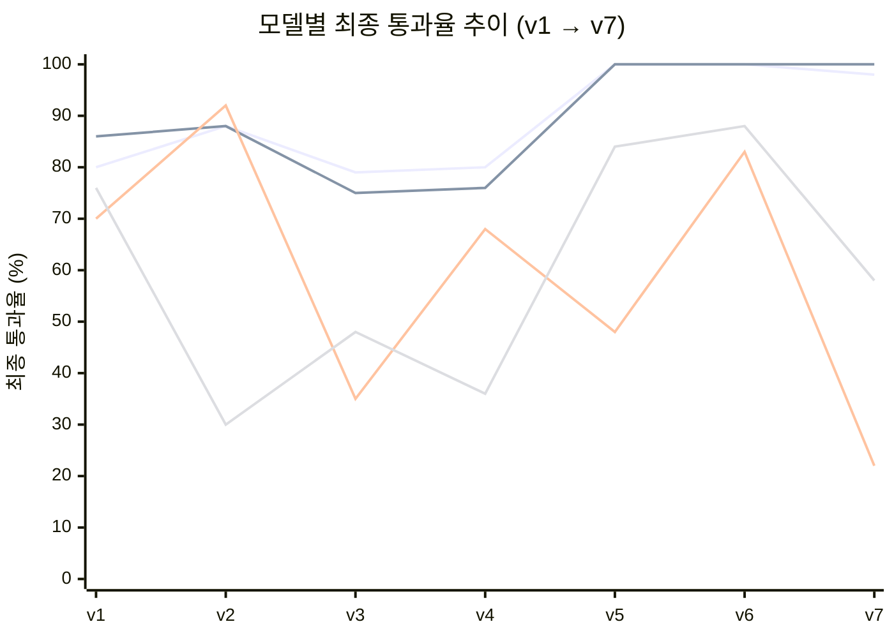

# Model 선택

## 결론: **qwen2.5:7b** (동급: `qwen2.5-coder:7b`)

v1(인공 문서)→v7(실제 스케일 전체 파이프라인) 전 구간에서 유일하게 상위권을 유지한
모델 계열. v4·v5·v7에서 `qwen2.5-coder:7b`와 완전 동률이라 이 데이터만으로는 둘을
가를 수 없다 — 갱신(2026-09-22).

> v2~v3·v6은 군 구성이 버전마다 달라 절대 수치를 그대로 비교하면 안 된다
> (`docs/common/methodology.md` §5 "다른 버전의 CSV는 합치지 않는다"). 이 선은
> **추세**(오르내림의 방향과 폭)를 보기 위한 것이지, 버전 간 절대 비교가 아니다.

qwen 계열 둘만 굴곡 없이 80%대 이상을 유지하다 v5~v6에서 100%에 도달한다. exaone은
v2(92%)→v3(35%)로 급락했다가 v4(68%)로 반등, v5(48%)에서 다시 붕괴하고 v7(22%)에서
사실상 전멸한다 — **조건에 따라 순위가 뒤집히는 불안정성 자체가 감점 요인**이었는데,
v5~v7로 그 불안정성의 정체(JSON을 다루는 순간 무너짐)가 명확해졌다. gemma는 v2 이후
계속 30~50%대에 머물다 v5~v6에서 잠깐 80%대로 올라오지만 v7(58%)에서 다시 떨어진다.

## 근거 — 버전별 최종 통과율

| 버전 | qwen2.5:7b | qwen2.5-coder:7b | exaone3.5:7.8b | gemma3:4b | 무엇을 쟀나 |
| --- | --- | --- | --- | --- | --- |
| v1 (인공 문서, 6종 군) | 80% (579/720) | 86% (309/360) | 70% (503/720) | 76% (547/720) | 기본 생성·수정·라우팅 |
| v2 (인공 문서, JSON) | 88% (140/160) | 88% (70/80) | 92% (147/160) | 30% (71/240) | JSON 계획/패치 |
| v3 (인공 문서, JS 3방식) | 77% (294/380) | 73% (286/393) | 37% (142/382) | 47% (186/395) | JS 인터랙션 + CHAIN |
| **v4 (실제 템플릿, 통일 채점)** | **80%** (80/100) | 76% (76/100) | 68% (68/100) | 36% (36/100) | 기존 문서 수정(S-E vs K-T) |
| **v5 (실제 템플릿)** | **100%** (100/100) | **100%** (100/100) | 48% (48/100) | 84% (84/100) | 신규 생성(S-T vs J-T) |
| v6 (구조/표현 변경) | **100%** (90/90) | **100%** (90/90) | 83% (75/90) | 88% (79/90) | 요청 표현을 바꿔 실패 제거 |
| **v7 (실제 스케일 CHAIN7)** | 98% (88/90) | **100%** (90/90) | 22% (20/90) | 58% (52/90) | 4단계 전체 파이프라인 |

**v4·v5·v7이 결정 근거로 가장 무겁다** — 인공 문서(370~590자)가 아니라 실제 제품
템플릿(1,000~5,356자)을 같은 채점기로 쟀고, 그중에서도 v7은 개별 축이 아니라
**파이프라인 전체**를 재서 가장 서비스 조건에 가깝다.

## qwen2.5-coder:7b — v7까지도 동급, 대체 후보로 유효

- v4 S-E(수정) 둘 다 **50/50 만점**, 클래스 파손 0건 — 차이는 K-T(구조 변경)에서만 24%p
- v5 신규 생성(J-T·S-T) **100/100 동률**
- **v7 CHAIN7S(HTML 경로 전체 파이프라인)에서 유일하게 10/10 만점** — qwen2.5:7b는
  9/10으로 근소하게 낮음. 코드/마크업 특화 모델이라 HTML 생성 목적과도 부합.

## 탈락 확정: gemma3:4b

| 근거 | 수치 |
| --- | --- |
| v2 K(패치) 전멸 | 0/150 |
| v4 K-T(실제 템플릿) | 1/50 (2%) |
| v4 마크업 파손 | `unmatched_closing_tag_div`·`mismatched_nesting_section` — **gemma에서만 발생** |
| v6 K-COUNT(표현을 바꿔도) | 9/20 (45%) — 표현을 바꿔도 안 풀리는 계열 고유 한계 |
| **v7 CHAIN7J·CHAIN7S** | **0/10 · 0/10 — 양쪽 다 전멸** |

v5~v6에서 84~88%까지 회복하는 것처럼 보였지만, **파이프라인으로 이으면(v7) 다시
전멸**한다 — 단일 축 성능이 파이프라인 생존을 보장하지 않는다는 걸 보여주는 대표 사례.
저사양 대안으로 문서에 남아있었으나, **실제 크기·실제 파이프라인에서는 채택 불가**로 확정.

## 탈락 확정: exaone3.5:7.8b

- v2 CHAIN(K 강세)에서는 92%로 1위였으나 **v4 실제 템플릿에서는 68%로 하락** — 조건이
  실제 크기로 바뀌자 순위가 뒤집힘
- **v5 J-T(신규 생성, JSON)에서 1/50(2%)로 붕괴** — 같은 조건 S-T는 94%. "텍스트 필드에
  마크업을 못 뺀다"는 결함이 처음 뚜렷하게 드러남
- S-E `class_lost` 15/50 — 두 기기에서 동일하게 재현되는 모델 고유 결함(v4)
- **v7 CHAIN7J·CHAIN7S 양쪽 다 0/10** — v5까지는 "S 단독 경로로는 쓸 만하다"고 봤으나,
  다단계 체인으로 이으면 그마저 무너짐이 확인됨
- **최종 결론: JSON을 다루는 모든 단계(J-T·K-T·CHAIN7)에서 탈락, S 단독 벤치마크
  점수만으로 채택하면 안 됨**

## 확정 조건

| 항목 | 값 |
| --- | --- |
| 최종 후보 | `qwen2.5:7b` |
| 대체 후보 | `qwen2.5-coder:7b` — v4·v5 완전 동급, v7 CHAIN7S 유일 만점 |
| 탈락 확정 | `gemma3:4b`, `exaone3.5:7.8b` (v7 CHAIN7 양쪽 다 0/10) |
| 재현 기기 | v1(4기기) → v4(2기기: 도하·주호) → v7(2기기: 윤기·주호) — **v1만큼 두텁지 않음** |
| 다음 단계 | v8부터 로컬 대신 AWS Bedrock으로 전환(`docs/bedrock/v1-migration.md`) — 이 문서의
  로컬 결론은 Bedrock 모델 비교의 출발점(대조군)으로만 쓰임 |
