# 생성 + 수정 + JS 생성/수정 방식

모델은 `model.md` 참고 — **qwen2.5:7b** 기준 수치. v5~v7 반영해 갱신(2026-09-22).

## 축별 결론

| 축 | 채택 | 근거 수치 |
| --- | --- | --- |
| 신규 생성 | **S 또는 J — 둘 다 무방** | **v5**: qwen2.5:7b·qwen2.5-coder:7b 모두 J-T 100/100·S-T 100/100 완전 동률(실제 템플릿 크기) — "수정에서 S가 낫다"가 생성에는 적용되지 않음 |
| 기존 문서 수정 | **E** (HTML 블록 왕복 편집) | v4 실제 템플릿: **S-E 50/50(100%) vs K-T 30/50(60%)** — 인공 문서에서의 "K가 안전하다"는 결론이 실제 크기에서 뒤집힘 |
| JS 추가 | **JS-PLAN** (생성 시점에 포함) | v3: JS-PLAN 29/30 vs JS-PATCH(사후 추가) 22/30 |
| JS 값 수정 (날짜 등) | **CHAIN7로 확정 조합 검증 완료(파일럿)** | **v7**: 확정 조합(S/J생성→E수정→JS-PLAN)을 4단계로 이었을 때 qwen 계열 CHAIN7J 10/10·CHAIN7S 9~10/10. gemma·exaone은 0/10 |
| 요청 표현 | **"지어낼 것"을 안 주면 실패가 사라짐** | **v6**: `J-STRUCT`(구조만 출력) 100%, `K-COUNT`(`itemCount`로 표현 변경) 0%→100% |

## 1. 신규 생성 — S 또는 J, 둘 다 무방 (v5로 확정)

- v4까지는 이 축을 **못 쟀다** — 실제 템플릿 생성 시 필요한 출력 토큰(1,985~2,443)이
  `num_predict` 캡(1536)을 초과해서 전부 미측정이었다.
- **v5가 케이스별 `num_predict` 오버라이드로 이 캡을 풀고 재측정**했다. 결과:

| 모델 | J-T (신규 생성, JSON 계획) | S-T (신규 생성, HTML 직접) |
| --- | --- | --- |
| **qwen2.5:7b** | **50/50 (100%)** | **50/50 (100%)** |
| **qwen2.5-coder:7b** | **50/50 (100%)** | **50/50 (100%)** |
| gemma3:4b | 41/50 (82%) | 43/50 (86%) |
| exaone3.5:7.8b | **1/50 (2%)** | 47/50 (94%) |

- qwen 계열은 **완전 동률**이라 형식을 하나로 확정할 근거가 없다 — S1~S9/J1/J2/J8/J9(v1↔v2)
  McNemar 비교에서 이미 "불일치 0쌍"이 나왔던 것과 같은 결론이 실제 템플릿 크기에서도
  재현된 것이다.
- **exaone3.5:7.8b는 J-T에서만 1/50로 붕괴** — S-T(94%)는 멀쩡하다. "JSON을 다루는
  순간 텍스트 필드에 마크업을 못 뺀다"는 결함이 여기서 처음 뚜렷하게 드러났고, 이후
  K-T·CHAIN7-J에서도 반복된다(모델선정_종합보고서.md §2 v5·v7).

## 2. 기존 문서 수정 — E

인공 문서 vs 실제 템플릿 비교가 결론을 뒤집은 핵심 지점. (v4는 이 축의 테스트
그룹을 "S-E"라 이름 붙였다 — S 규칙으로 쓰는 HTML 생성기를 블록 하나에 좁혀 쓰는
방식이라 그런 이름이지, 실제로 재는 건 `docs/common/methodology.md`의 **E군(왕복 단위)**이다.)

```mermaid
%%{init: {"xyChart": {"plotColorPalette": "#4e79a7, #f28e2b, #e15759, #59a14f, #b07aa1, #edc948, #76b7b2, #ff9da7"}}}%%
xychart-beta
    title "v4 실제 템플릿 — 수정 경로별 최종 통과율 (%)"
    x-axis ["qwen2.5:7b", "qwen2.5-coder:7b", "exaone3.5:7.8b", "gemma3:4b"]
    y-axis "통과율 (%)" 0 --> 100
    bar "S-E (HTML 블록 수정)" [100, 100, 80, 70]
    bar "K-T (JSON 패치)" [60, 52, 56, 2]
```



네 모델 전부 S-E가 K-T보다 높고, gemma는 K-T에서 사실상 전멸(2%)한다.

| 조건 | E 계열 | K 계열 |
| --- | --- | --- |
| v2 인공 문서(370~590자) | — | 88~92% |
| **v4 실제 템플릿(1,000~1,500자)** | **100%** (50/50) | 60% (30/50) |

- K의 지배적 실패는 `no_ops`(30%, 219/725건) — **패치 오퍼레이션 자체를 못 냄**
- 구조 변경(항목 추가/삭제) 요청 시 K는 전 모델 0/5 (KT3) — 실사용에서 흔한 요청인데 구조적으로 막힘
- "J/K가 서버 소유라 클래스 안 깨진다"는 원래 채택 이유가, 실측에서는 **모델 문제**로 확인됨(qwen 계열은 E로 써도 `class_lost` 0건)
- **v6가 이 구조 변경 실패의 원인을 특정했다** — §5 참고. 오퍼레이션 이름(`remove_item`)이
  문제였지, "구조 변경 자체를 못 하는" 게 아니었다.

## 3. JS 추가 — JS-PLAN 우선

| 모델 | JS-PLAN (생성 시 포함) | JS-PATCH (사후 add_block) |
| --- | --- | --- |
| qwen2.5:7b | **29/30** | 22/30 |
| qwen2.5-coder:7b | 24/30 | 18/30 |
| gemma3:4b | 18/30 | **0/30** |

- JS-PATCH는 gemma에서 완전히 무너짐 — add_block 자체가 K와 같은 메커니즘이라 §2의 K 취약점을 그대로 물려받음
- "나중에 추가"가 실사용 시나리오에 더 가깝지만, 지금 데이터로는 **생성 시점에 포함시키는 쪽이 안전**

## 4. JS 값 수정 — v7 CHAIN7로 검증 완료 (파일럿)

```mermaid
%%{init: {"xyChart": {"plotColorPalette": "#4e79a7, #f28e2b, #e15759, #59a14f, #b07aa1, #edc948, #76b7b2, #ff9da7"}}}%%
xychart-beta
    title "v3 CHAIN 파이프라인 전체 완주 (5회×3기기=15회 중)"
    x-axis [CHAIN2, CHAIN3, CHAIN4, CHAIN5, CHAIN6]
    y-axis "완주 횟수 (/15)" 0 --> 15
    bar "qwen2.5:7b" [1, 6, 12, 9, 15]
    bar "qwen2.5-coder:7b" [0, 5, 14, 8, 15]
```



순수 JSON 4단계(CHAIN2)만 유독 낮고, HTML+JSON을 섞은 CHAIN6은 두 모델 다 만점이다.

| CHAIN | 구성 | qwen2.5:7b | qwen2.5-coder:7b |
| --- | --- | --- | --- |
| CHAIN2 | J생성→K수정→JS-PATCH→K날짜수정(순수 JSON) | 1/15 | 0/15 |
| CHAIN5 | J생성→K수정→JS-HTML→전체재작성(JSON+HTML 교차) | 9/15 | 8/15 |
| CHAIN6 | S생성→E수정→JS-PATCH류→K날짜수정(HTML+JSON 교차) | **15/15** | **15/15** |

- "값 수정이 안 되는" 게 아니라 **순수 JSON 4단계(CHAIN2)에서만 무너진다** — 원인 일부는 특정·수정함(GEN이 요청 안 한 카운트다운을 스스로 만들어 후속 단계와 충돌하던 gap, `GEN_FORBID`로 조치)

**v7이 이 축의 "다음 단계"(당시 §의 남은 과제)를 실행했다** — §1·§2가 확정한 조합
(신규 생성=S 또는 J, 수정=E, 인터랙션=JS-PLAN)을 그대로 이은 CHAIN7:

| 모델 | CHAIN7J (J생성→E수정→JS-PLAN) | CHAIN7S (S생성→E수정→JS-PLAN) |
| --- | --- | --- |
| **qwen2.5:7b** | **10/10 (100%)** | 9/10 (90%) |
| **qwen2.5-coder:7b** | **10/10 (100%)** | **10/10 (100%)** |
| gemma3:4b | 0/10 (0%) | 0/10 (0%) |
| exaone3.5:7.8b | 0/10 (0%) | 0/10 (0%) |

- qwen 계열만 파이프라인 전체가 생존한다 — **개별 축 성능이 좋아도 체인으로 이으면
  갈릴 수 있다는 것**을 실제로 확인했다(gemma·exaone은 CHAIN7 양쪽 다 전멸).
- 지배적 실패는 `chain_blocked_by_previous_stage_failure`(13%, v-summary.md v7) — 한
  단계가 실패하면 이후 단계는 아예 시도되지 않고 막힌다.
- 표본은 파일럿(2기기·n=10)뿐 — v1급 표본(4기기·3000행 이상)으로 재검증된 적은 없다.

## 5. 요청 표현 축 — v6, "모델을 바꾸지 않고 실패를 없애기"

§2·§4에서 반복된 "구조 변경(추가/삭제)을 K가 못 한다"는 관찰의 **원인**을 v6이 파헤쳤다.

| 모델 | J-STRUCT (구조만 출력) | K-COUNT (`itemCount`로 표현 변경) |
| --- | --- | --- |
| **qwen2.5:7b** | **45/45 (100%)** | **20/20 (100%)** |
| **qwen2.5-coder:7b** | **45/45 (100%)** | **20/20 (100%)** |
| gemma3:4b | 45/45 (100%) | 9/20 (45%) |
| exaone3.5:7.8b | 40/45 (89%) | 10/20 (50%) |

- **`remove_item` 대신 `set_field itemCount`로 오퍼레이션 이름만 바꾸자** qwen 계열이
  0%대에서 100%로 반전됐다 — §2·모델선정_종합보고서.md가 "K는 구조 변경을 못 한다"고
  본 것은 **능력 부족이 아니라 오퍼레이션 이름에 대한 회피**였다는 결정적 증거.
- **`J-STRUCT`(문구는 안 시키고 구조 결정만 시킴)로 바꾸면 `placeholder`류 환각 실패가
  사라진다** — v5에서 32%였던 `placeholder` 실패가 이 표현 변경만으로 해소된다.
- **읽는 법 주의**: 이건 "LLM이 응답을 끝까지 완성"하는 방식이 아니라 **구조만 결정하고
  나머지는 사용자가 채우는** 방식이라, 완전 자동 생성이 목표라면 그대로 채택할 수는
  없다(`docs/bedrock/v1-migration.md` §6 참고). 그래도 "표현을 바꾸면 실패가 없어진다"는
  발견 자체는 §1·§2·§4의 결론을 다시 읽게 만든다.

## 종합 파이프라인 (v7 기준 확정)

```
신규 생성        S 또는 J  (v5로 확정 — 둘 다 무방, qwen 계열 100% 동률)
기존 문서 수정    E  (블록 왕복 편집)
인터랙션 추가    JS-PLAN  (생성 시점에 포함)
인터랙션 값 수정  CHAIN7로 검증 완료 — qwen 계열만 전체 생존(파일럿)
```

## 남은 확인 사항

- **5단계 누적 수정 비교(E×5 vs K×5)** — v3 CHAIN5/6이 원래 이 역할을 할 계획이었으나
  구현 단계에서 다른 것(JS 교차조합)으로 대체됐고, v7도 4단계까지만 다뤄 여전히 미착수.
- **전역 CSS 전파** — J(JSON) 경로만 가능한 기능. 성능 문제가 아니라 "제품에 이 기능이
  필요한가"를 팀이 먼저 결정해야 함.
- **v7 표본 확대** — 파일럿(2기기·n=10)을 v1급 규모로 재검증.
- v8부터는 이 파이프라인 자체가 아니라 **모델 선택**이 남은 질문이 된다
  (`docs/bedrock/v2-pipeline.md`, 최상위 `README.md`의 v8~v9 결론 참고).
